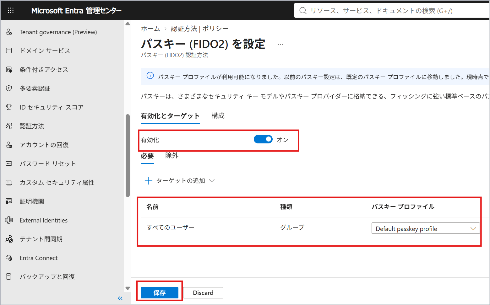
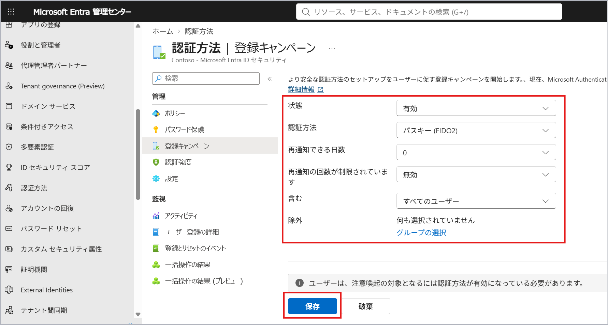
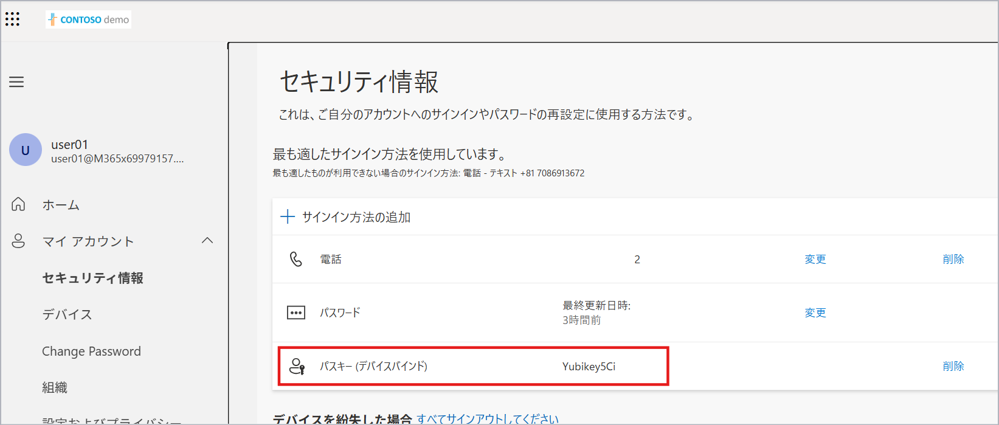

# 登録キャンペーンを利用して認証方法にパスキー (セキュリティ キーを利用) をセットアップする手順

こんにちは、Azure Identity サポート チームの長谷川です。

この記事では、MFA の認証方法を SMS や音声通話からパスキーへ移行する際に、組織内のユーザーへのパスキー展開を効率的に進めるために役立つ[登録キャンペーン](https://learn.microsoft.com/entra/identity/authentication/how-to-mfa-registration-campaign) を利用したセットアップ方法をご紹介します。

現在、多くの組織で MFA (多要素認証) が広く利用されていますが、その認証方法として SMS や音声通話を利用しているユーザーも数多く存在します。すでに公開されているとおり、[Microsoft Entra ID が既定で提供している SMS や音声通話といった電話網ベースの認証方法は廃止に向けた移行が進められています](https://learn.microsoft.com/entra/identity/authentication/concept-sms-voice-retirement)。そのため、パスキーの導入や展開を検討されているお客様も多いのではないでしょうか。

登録キャンペーンを利用することで、組織内へのパスキー展開を効率的に進めることができます。前述の公開情報でも設定方法が紹介されていますが、テキスト中心の説明のため、具体的なイメージを持ちにくい場合があります。本記事では、各手順をスクリーン ショット付きでわかりやすく解説していますので、パスキー展開時の参考としてぜひご活用ください。

## 1. 想定シナリオ
- この記事では、すでに電話 (SMS) を MFA の認証方法として利用しているユーザーが、セキュリティ キーを利用したパスキーをセットアップする手順を紹介します。
- セキュリティ キーの機種によっては、利用を開始する前に、暗証番号 (PIN) の設定など、セキュリティ キー自体の初期設定が必要な場合があります。必要な事前準備については、ご利用のセキュリティ キーのベンダーにご確認ください。
- この記事では、事前設定が完了した YubiKey 5Ci を使用して手順を作成しています。
- また、この記事の手順では Microsoft Edge を使用しています。他のブラウザーを利用する場合、一部の画面やポップアップの表示が異なることがあります。

## 2. 事前準備
パスキーを利用するには、[認証方法ポリシー](https://learn.microsoft.com/entra/identity/authentication/how-to-authentication-methods-manage#authentication-methods-policy)でパスキー (FIDO2) が有効化されており、対象ユーザーを含むグループがターゲットとして設定されている必要があります。
管理者にて [Microsoft Entra 管理センター (entra.microsoft.com)] > [認証方法] > [ポリシー](https://entra.microsoft.com/#view/Microsoft_AAD_IAM/AuthenticationMethodsMenuBlade/~/AdminAuthMethods/fromNav/) > [パスキー(FIDO2)] で有効化し、対象のユーザーを含むグループがターゲットに追加されていることを確認してください (下図のようにグループではなくすべてのユーザーを指定することもできます)。

## 3. 登録キャンペーンの有効化

3-1. [Microsoft Entra 管理センター (entra.microsoft.com)] > [認証方法] > [登録キャンペーン](https://entra.microsoft.com/#view/Microsoft_AAD_IAM/AuthenticationMethodsMenuBlade/~/RegistrationCampaign/fromNav/) にアクセスします。

3-2. 次のように設定し [保存] します。

| 設定項目 | 設定値 |
| ---- | ---- |
| 状態 | 有効 |
| 認証方法 | パスキー (FIDO2) |
| 再通知できる日数 | 任意に設定します。登録キャンペーンによる登録画面が表示される間隔を指定します。 |
| 再通知の回数が制限されています | 任意に設定します。有効になっている場合は、ユーザーは登録キャンペーンによる登録画面を 3 回スキップできますが、4 回目以降は登録が強制されます。 |
| 含む | 登録キャンペーンの対象にするユーザーのグループを指定します。 |
| 除外 | 登録キャンペーンから除外したいユーザーを明示的に指定します。 |

> [!NOTE]
> 登録キャンペーンを有効化後、実際に登録キャンペーンによって認証方法の登録が要求されるようになるまで少し時間がかかる場合があります（検証環境では 1 時間程度かかった事例があります)。

## 4. 登録キャンペーンでパスキーの登録 (セットアップ) を完了させるまでの流れ

登録キャンペーンは MFA が完了したタイミングで動作します。この動作をスクリーンショット付きで紹介します。

4-1. MFA を完了させます。

4-2. 「アカウントをセキュリティ保護しましょう」という認証方法の登録を誘導する画面が表示されますので [次へ] 進みます。

> [!TIP]
> なお、この「アカウントをセキュリティ保護しましょう」の画面で [今はしない] を選択すると認証方法の登録をスキップすることができます。
> 

4-3. 以下のパスキーの登録が始まる画面が表示されます。セキュリティ キーが作業端末に接続されていることを確認してから [次へ] 進みます。

4-4. パスキーの登録が開始されます。自動で次の画面に遷移します。

4-5. パスキーの保存先を指定します。既定では下図のように Windows に保存する選択肢になっている場合があります。この場合は [変更] を選択します。

4-6. パスキーの保存先選択画面が表示されるのでセキュリティ キーを選択します。

4-7. セキュリティ キーのモデルによっては事前に設定した暗証番号 (PIN) の入力が要求されるので入力してから [OK] を選択します。

4-8. セキュリティ キーのモデルによってはキーへの物理的な接触が要求されますので、キーに触れます。

4-9. 後でセキュリティ情報ページで識別できるよう、パスキーに任意の名前を付けて [次へ] を選択します。

4-10.  [完了] を選択してパスキーの登録 (セットアップ) を終了します。

> [!TIP]
> 登録したパスキーは各自の[セキュリティ情報](https://aka.ms/mysecurityinfo)のページから確認することができます。
> 

## 5. おわりに
以上、登録キャンペーンを利用して認証方法にパスキー (セキュリティ キー) をセットアップする手順を紹介しました。
パスキーはフィッシング耐性を備えた認証方法であり、今後、認証方法の中心となることが期待されています。
SMS や音声通話を利用した認証方法の廃止に備え、本記事を参考に登録キャンペーンを活用したパスキー展開をご検討ください。
製品動作に関する正式な見解や回答については、お客様環境などを十分に把握したうえでサポート部門より提供しますので、ぜひ弊社サポート サービスをご利用ください。