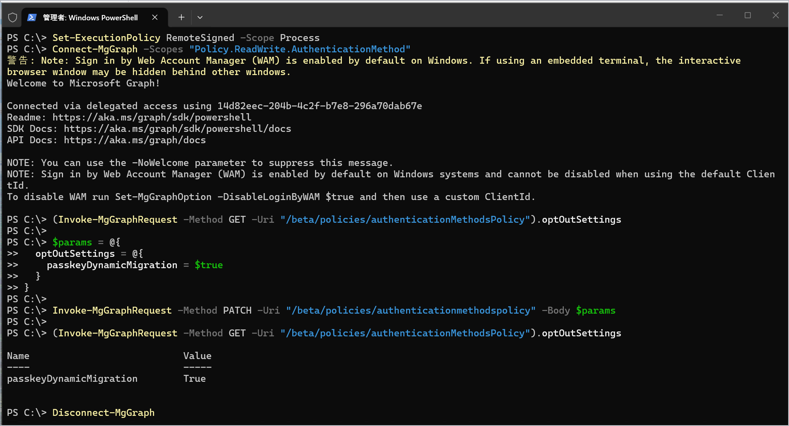

# 自動パスキー有効化を一時的にオプトアウトする手順

こんにちは、Azure & Identity サポート チームの長谷川です。
[既定で提供されている SMS/音声通話の廃止が案内されました](https://learn.microsoft.com/entra/identity/authentication/concept-sms-voice-retirement)。それに伴い 2026 年 9 月 1 日以降に順次パスキーと登録キャンペーンの自動有効化が順次展開されていく見込みです。

一方で、組織によってはこの自動有効化を延期したい要望もあり、この要望に対応するための [自動パスキー有効化を一時的にオプトアウトする](https://learn.microsoft.com/entra/identity/authentication/concept-sms-voice-retirement#temporarily-opt-out-of-the-automatic-passkey-enablement)設定が公開されました。
しかしながら、公開されたオプトアウト設定 (optOutSettings) 手順は、慣れた人でないと設定が難しいとのご意見をいただいております。そのため、Windows 11 上でオプトアウト設定作業を実施する際のステップ バイ ステップの手順を紹介します。
なお、上述の公開情報では、Microsoft Graph API の Web リクエストを手動で作成して設定する手順になっておりますが、今回紹介する手順では、より簡易に実施するために Microsoft Graph PowerShell モジュールを利用します(実施する設定内容は同じです)。

## Microsoft Graph PowerShell モジュールを利用してオプトアウトする手順

1. PowerShell を管理者権限で起動します。

2. 以下のコマンドを実行し、Microsoft Graph PowerShell モジュールをインストールします。(既にモジュールがインストールされている場合はスキップしてください)

    ```powershell
    Install-Module Microsoft.Graph -Force
    ```
 
3. 以下のコマンドを実行し、対象テナントのグローバル管理者でサインインします。
([要求されているアクセス許可] という画面が表示された場合は、[承諾] を押下します)
(「このデバイスのすべてのアプリ、Web サイト、サービスにサインインしますか?」が表示された場合は「いいえ、このアプリのみです」を選択してください)
※ グローバル管理者を利用しない場合は、実行するユーザーに 2 つのロール (クラウド アプリケーション管理者と認証ポリシー管理者) が付与されていれば実行可能です。

    ```powershell
    Set-ExecutionPolicy RemoteSigned -Scope Process
    Connect-MgGraph -Scopes "Policy.ReadWrite.AuthenticationMethod"
    ```

4. 以下のコマンドを実行し、現在の optOutSettings の設定を確認します。オプトアウトを設定していない場合は、何も出力されません。

    ```powershell
    (Invoke-MgGraphRequest -Method GET -Uri "/beta/policies/authenticationmethodspolicy").optOutSettings
    ```

5. 以下のコマンドを実行して optOutSettings を true に変更してオプトアウトします。

    ```powershell
    $params = @{
      optOutSettings = @{
        passkeyDynamicMigration = $true
      }
    }

    Invoke-MgGraphRequest -Method PATCH -Uri "/beta/policies/authenticationmethodspolicy" -Body $params
    ```

6. 以下のコマンドを実行して optOutSettings の設定が変更されたことを確認します。

    ```powershell
    (Invoke-MgGraphRequest -Method GET -Uri "/beta/policies/authenticationmethodspolicy").optOutSettings
    ```

7. 作業完了後、以下のコマンドでセッションを切断し作業を終了します。

    ```powershell
    Disconnect-MgGraph
    ```

上記コマンド実行時の PowerShell 画面イメージは以下の通りです。



## 免責事項

本サンプル コードは、あくまでも説明のためのサンプルとして提供されるものであり、製品の実運用環境で使用されることを前提に提供されるものではありません。
本サンプル コードおよびそれに関連するあらゆる情報は、「現状のまま」で提供されるものであり、商品性や特定の目的への適合性に関する黙示の保証も含め、明示・黙示を問わずいかなる保証も付されるものではありません。
マイクロソフトは、お客様に対し、本サンプル コードを使用および改変するための非排他的かつ無償の権利ならびに本サンプル コードをオブジェクト コードの形式で複製および頒布するための非排他的かつ無償の権利を許諾します。
但し、お客様は以下の 3 点に同意するものとします。

(1) 本サンプル コードが組み込まれたお客様のソフトウェア製品のマーケティングのためにマイクロソフトの会社名、ロゴまたは商標を用いないこと  
(2) 本サンプル コードが組み込まれたお客様のソフトウェア製品に有効な著作権表示をすること  
(3) 本サンプル コードの使用または頒布から生じるあらゆる損害（弁護士費用を含む）に関する請求または訴訟について、マイクロソフトおよびマイクロソフトの取引業者に対し補償し、損害を与えないこと

## おわりに
本記事では自動パスキー有効化を一時的にオプトアウトする手順を具体的に紹介しました。製品動作に関する正式な見解や回答については、お客様環境などを十分に把握したうえでサポート部門より提供しますので、ぜひ弊社サポート サービスをご利用ください。
